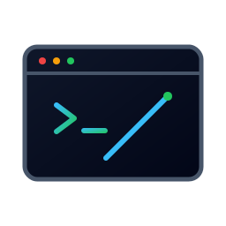

<div align="center">

<picture>
  <source media="(prefers-color-scheme: dark)" srcset="./docs/assets/logo.svg" />
  
</picture>

<br/>
<br/>

[](LICENSE)
[](https://github.com/code-lodge/shellwright/releases/latest)
[](https://github.com/code-lodge/shellwright/actions/workflows/release.yml)
[](https://github.com/code-lodge/shellwright/releases/latest)

<br/>

**A cross-platform tiling window manager written in Rust — automatic, keyboard-driven layouts with multi-monitor support, smooth animations, and a clean TOML config.**

[Website](https://code-lodge.github.io/shellwright) · [Download](#-quick-start) · [Configuration](#%EF%B8%8F-configuration) · [Contributing](#-contributing)

</div>

---

## Why Shellwright?

Most window managers either demand you spend a weekend configuring them or lock you into a rigid workflow. Shellwright takes a different approach: sensible defaults that work on day one, a single TOML file for everything you want to change, and no tray icon, no taskbar widget, no Electron — just a lean Rust binary sitting quietly in the background arranging your windows.

It runs entirely via keybindings. Open a window and it tiles. Close one and the rest re-tile. Switch workspaces, swap window positions, and change layouts — all without touching a mouse.

## Features

- 🪟 **Automatic tiling** — windows arrange themselves as they open and close, no dragging required
- ⌨️ **Fully keyboard-driven** — focus, move, and resize without leaving the home row
- 🖥️ **Multi-monitor** — independent workspace and layout per monitor
- 🎨 **Overlay borders** — crisp GDI borders with configurable colour and radius on Win10 and Win11
- ✨ **Smooth animations** — configurable easing on window moves and workspace transitions
- 🔀 **Six layouts** — Fibonacci, BSP, Monocle, Columns, CenterMain, Float
- 🏷️ **Float rules** — auto-float windows by exe, class, or title substring
- 📋 **9 workspaces** — per-workspace layouts, cross-monitor window movement
- 🔧 **TOML config with hot-reload** — change anything and press `Alt+Shift+R`, no restart needed
- 📡 **YASB IPC** — named-pipe workspace indicator for your status bar

---

## Quick Start

### Download

| Platform | Installer | Notes |
| -------- | --------- | ----- |
| Windows x64 | [Download MSI →](https://github.com/code-lodge/shellwright/releases/latest) | Windows 10 / 11 |

### Build from source

You will need the [Rust toolchain](https://rustup.rs/) (stable, 1.75+).

```powershell
git clone https://github.com/code-lodge/shellwright
cd shellwright
cargo build --release
.\target\release\window-manager.exe
```

A default config is created at `%APPDATA%\shellwright\config.toml` on first run. Logs are written to `%APPDATA%\shellwright\shellwright.log`.

### Autostart

```powershell
# Register — adds a Run registry key
.\target\release\window-manager.exe autostart-register

# Remove
.\target\release\window-manager.exe autostart-unregister
```

---

## Keybindings

| Keys | Action |
| ---- | ------ |
| `Alt + H` | Focus previous window |
| `Alt + L` | Focus next window |
| `Alt + Shift + H` | Move window left in layout order |
| `Alt + Shift + L` | Move window right in layout order |
| `Alt + Shift + Q` | Close focused window |
| `Alt + F` | Toggle fullscreen |
| `Alt + Shift + Space` | Toggle floating / tiled |
| `Alt + G` | Switch to Fibonacci layout |
| `Alt + T` | Switch to BSP layout |
| `Alt + M` | Switch to Monocle layout |
| `Alt + C` | Switch to Columns layout |
| `Alt + U` | Switch to CenterMain layout |
| `Alt + 1 … 9` | Switch to workspace 1–9 |
| `Alt + Shift + 1 … 9` | Move focused window to workspace 1–9 |
| `Alt + Shift + R` | Reload config |
| `Alt + Shift + E` | Quit |

---

## Layouts

| Layout | Description |
| ------ | ----------- |
| **Fibonacci** _(default)_ | Dwindle spiral — window 0 takes the first half, the rest recurse inward alternating H/V splits |
| **BSP** | Binary space partition — screen is recursively halved alternating horizontal and vertical |
| **Monocle** | All windows stacked full-screen; switching focus raises the top window |
| **Columns** | Fixed number of equal-width columns (`set_layout:columns:N`) |
| **CenterMain** | Ultrawide three-column — 50% centre, 25% left, 25% right; ideal for games that won't fill a wide display |
| **Float** | All windows unmanaged |

---

## ⚙️ Configuration

Config lives at `%APPDATA%\shellwright\config.toml`. Created automatically on first run. Reload at any time with `Alt+Shift+R`.

<details open>
<summary><strong>Full reference</strong></summary>
<br/>

```toml
# ── Appearance ──────────────────────────────────────────────────────────────────
gap             = 8              # pixels between tiled windows
border_width    = 2              # overlay border thickness in pixels
border_active   = "#5E81AC"      # border colour for the focused window (#RRGGBB)
border_inactive = "#3B4252"      # border colour for all other windows  (#RRGGBB)
border_radius   = 8              # border corner radius (0 = square)

# ── Taskbar ─────────────────────────────────────────────────────────────────────
# "global" — windows on inactive workspaces stay in the taskbar at all times (default)
# "local"  — each workspace has its own taskbar entries
taskbar_mode = "global"

# ── Default layout ───────────────────────────────────────────────────────────────
# fibonacci | bsp | monocle | columns | center_main | float
default_layout = "fibonacci"

# ── YASB / external bar padding ──────────────────────────────────────────────────
# Shellwright reads SPI_GETWORKAREA which respects the OS taskbar but not
# third-party bars. Set these values to match your bar height.
[padding]
top    = 40    # e.g. 40 px for a top-aligned YASB bar
bottom = 0
left   = 0
right  = 0

# ── Animations ───────────────────────────────────────────────────────────────────
[animations]
enabled     = true
duration_ms = 80    # total easing time in ms — lower is faster
frames      = 6     # interpolation steps (1–60) — fewer is snappier

# ── Workspaces ────────────────────────────────────────────────────────────────────
[[workspaces]]
name = "1"
# Repeat up to 9 times. Name appears in the YASB workspace widget.

# ── Float rules ───────────────────────────────────────────────────────────────────
# Windows matching any rule start in floating mode.
# All specified fields must match (AND logic); omit a field to wildcard it.
#
# [[float_rules]]
# exe   = "steam.exe"
#
# [[float_rules]]
# class = "TaskManagerWindow"
#
# [[float_rules]]
# title_contains = "Properties"
# exe            = "explorer.exe"

# ── Keybindings ───────────────────────────────────────────────────────────────────
# Modifiers: "alt", "ctrl", "shift", "super" (Win key)
# Keys:      a–z, 0–9, f1–f12, return, space, tab, escape, backspace,
#            up, down, left, right, home, end, pageup, pagedown, and more.
#
# [[keybindings]]
# modifiers = ["alt"]
# key       = "h"
# action    = "focus_prev"
```

</details>

<details>
<summary><strong>All available actions</strong></summary>
<br/>

| Action | Effect |
| ------ | ------ |
| `focus_next` / `focus_prev` | Cycle keyboard focus |
| `move_next` / `move_prev` | Swap window position in layout order |
| `kill_focused` | Close focused window gracefully |
| `toggle_float` | Toggle between tiled and floating |
| `toggle_fullscreen` | Toggle true fullscreen (covers taskbar) |
| `set_layout:fibonacci` | Switch active workspace to Fibonacci |
| `set_layout:bsp` | Switch to BSP |
| `set_layout:monocle` | Switch to Monocle |
| `set_layout:columns:N` | Switch to N equal columns |
| `set_layout:center_main` | Switch to CenterMain |
| `set_layout:float` | Float all windows |
| `switch_workspace:N` | Activate workspace N (1-indexed) |
| `move_to_workspace:N` | Move focused window to workspace N |
| `reload_config` | Re-read config.toml without restarting |
| `quit` | Gracefully exit Shellwright |

</details>

---

## Architecture

Shellwright splits platform-agnostic logic from OS backends so each layer can be developed and tested independently.

```
crates/
  shellwright-core/      # Layouts, actions, config, workspaces, events
  shellwright-windows/   # Win32 — SetWindowPos, SetWinEventHook, GDI overlays
  shellwright-macos/     # macOS — Accessibility API (in progress)
  shellwright-wayland/   # Linux — Smithay compositor (in progress)
  shellwright/           # Binary — event loop, layout dispatch, keybinding dispatch
```

New layouts and actions go in `shellwright-core`. OS-specific code goes in the relevant backend crate.

---

## Feature Status

| Feature | Status | Platform |
| ------- | ------ | -------- |
| Fibonacci / BSP / Columns / CenterMain / Monocle | ✅ Done | All |
| GDI overlay borders (Win10 + Win11) | ✅ Done | Windows |
| DWM border colours (Win11 22H2+) | ✅ Done | Windows |
| Multi-monitor support | ✅ Done | Windows |
| 9 configurable workspaces | ✅ Done | All |
| Cross-monitor window movement | ✅ Done | Windows |
| Drag-to-swap tiled windows | ✅ Done | Windows |
| Minimized windows excluded from tiling | ✅ Done | Windows |
| Toggle float / fullscreen | ✅ Done | Windows |
| Float rules (class, title, exe) | ✅ Done | Windows |
| Smooth animations | ✅ Done | Windows |
| TOML config with hot-reload | ✅ Done | All |
| Global / local taskbar mode | ✅ Done | Windows |
| YASB named-pipe IPC | ✅ Done | Windows |
| Autostart via registry | ✅ Done | Windows |
| Float Layout | 🚧 In Progress | All |
| Monocle z-order focus raise | 🚧 In Progress | Windows |
| Proper manual window resizing | 🚧 In Progress | Windows |
| macOS backend (Accessibility API) | 🚧 In Progress | macOS |
| Wayland backend (Smithay) | 🚧 In Progress | Linux |
| Window rules for workspace auto-assignment | 📋 Planned | All |
| Per-workspace layout persistence | 📋 Planned | All |
| Scratchpad windows | 📋 Planned | All |
| X11 backend | 📋 Planned | Linux |

---

## Contributing

Contributions of any kind are welcome — bug reports, new layout algorithms, platform backend work, documentation improvements, or just ideas. To get started:

1. Fork the repository and create a feature branch.
2. New layouts and actions go in `shellwright-core`; OS-specific code goes in the relevant backend crate.
3. All public items should have doc comments. Add unit tests for new logic.
4. Open a pull request describing what you changed and why.

Shellwright is licensed under the **GNU General Public License v3.0**. See [`LICENSE`](LICENSE) for the full text.

---

<div align="center">



<br/>
<br/>

Made with care by [Hylke Hellinga](https://github.com/hylkehellinga)

</div>
